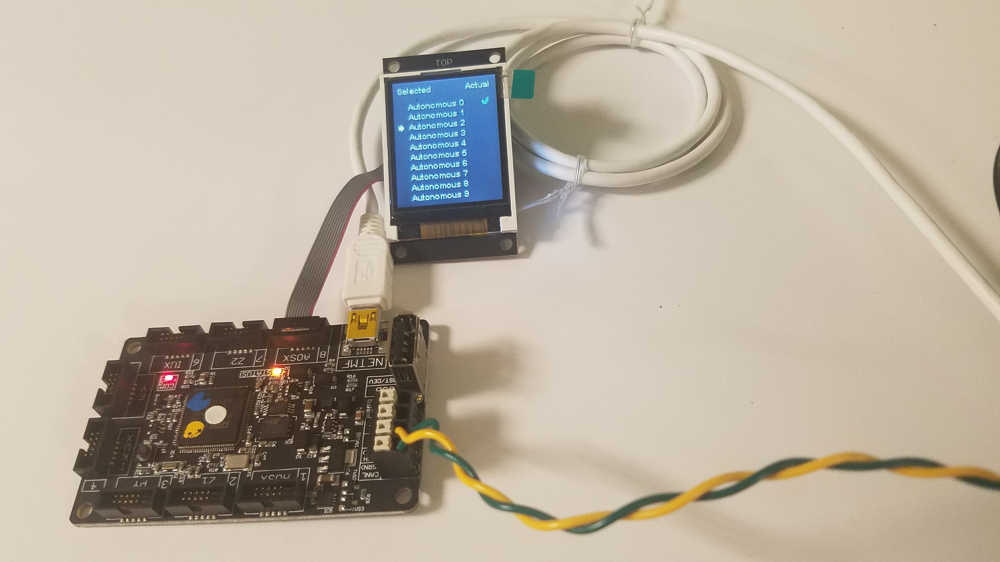
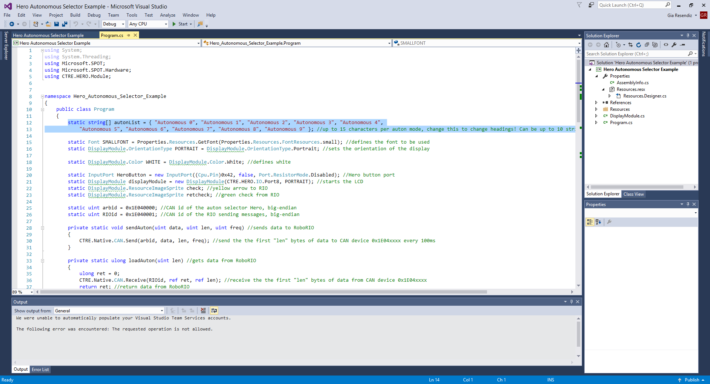
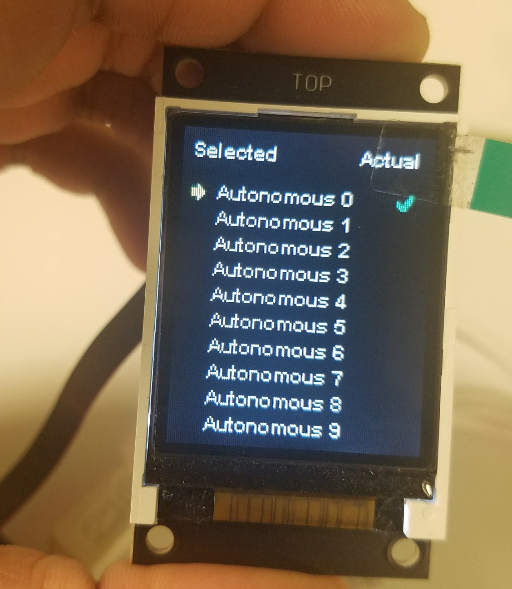
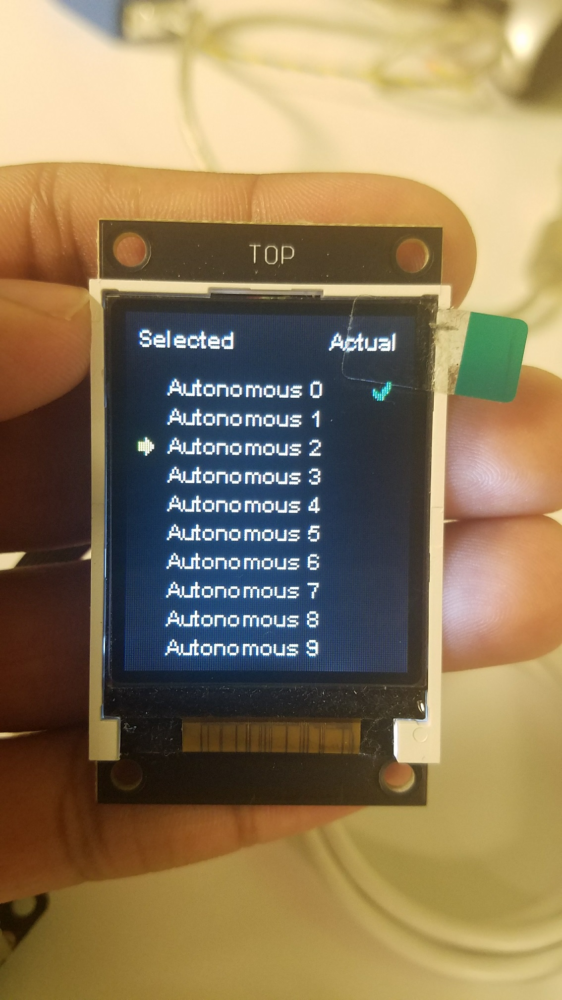

# HERO-Autonomous-Selector-Example
An autonomous selector for FRC using the HERO and a display module.

# Introduction
FRC teams often struggle with selecting autonomous modes before a match. If a multiswitch fails or there is not enough time to hardcode a selection, there is no indicator of what autonomous program will run on the robot. Use this autonomous selector program to set up a HERO Development Board to select an autonomous and verify that the robot is receiving the information via the CAN bus. The HERO will also store the selected autonomous so that it boots to the correct autonomous mode if power is lost.

# Setup
To begin, simply download and extract the project, and open it in Visual Studio. If you haven't done so already, you'll need to install the development tools for the HERO from the HERO main page: http://www.ctr-electronics.com/hro.html#product_tabs_technical_resources

Next, wire the HERO into the CAN bus like any other CAN device such as the Talon. Plug a Gadgeteer Display Module into the HERO on Port 8 (AOSX). 

*Correct wiring for the Autonomous Selector.*

Use a mini-usb cable to connect the HERO to your computer, and run the program from Visual Studio. Make sure that you've followed the correct steps to upload a program to the HERO, including selecting it in the .NET Framework tab's dropdown menu. If you have trouble, refer to the HERO documentation.
You should see a screen like the one in the image above, with a yellow arrow, a list of names, and a check mark. 

Note that you can change the names of the 10 selectable autonomous modes by editing the Program.cs file in the project. See the highlighted text below:

You can have up to 10 unique modes. 

# Usage
Using the autonomous selector is simple. Just press the button onboard the HERO to move the yellow pointer arrow down the list. The HERO will send a number to the RoboRIO over CAN (0-9) representing the selected mode; 0 is at the top of the list, and 9 is at the bottom. This range will be reduced if fewer than 10 modes are used. The RoboRIO must be programmed to send the same number back to the HERO, which will update the green check mark. 


*A correct display screen. The check mark should follow the yellow pointer.*

This allows the user to see both what the Hero is sending the RoboRIO, and what the RoboRIO sends back as an acknowledgement. If the check mark and arrow point to different autonomous modes, the RoboRIO probably does not have the correct autonomous selected and the communication should be checked.


*An incorrect display screen. Make sure the RoboRIO is receiving and sending data as it should.*


The HERO sends a single byte of data representing the selected mode every 100ms. The HERO sends this data using the Arbitration ID 0x1E040000. The RoboRIO should send the same number back in a single byte on the Arbitration ID 0x1E040001 to acknowledge that it has selected the correct autonomous mode. Note that the Arbitration ID is **not** the same as a Talon ID.

Here is a code snippet of how the CAN implementation on the RoboRIO should be set up for this example in Java:

```
int SendReceiveAuton(int currentSelection)
	{
		ByteBuffer targetedMessageID = ByteBuffer.allocateDirect(4);//Must be direct
		targetedMessageID.order(ByteOrder.LITTLE_ENDIAN); //Set order of bytes
		targetedMessageID.asIntBuffer().put(0, 0x1E040000); //Put the arbID into the buffer
		ByteBuffer timeStamp = ByteBuffer.allocateDirect(4); //Allocate memory for time stamp
		ByteBuffer selection = null;
		ByteBuffer currentS = ByteBuffer.allocateDirect(1);
		currentS.put((byte)currentSelection);
		try
		{
			//Return call is data, selection is assigned
			selection = CANJNI.FRCNetCommCANSessionMuxReceiveMessage(targetedMessageID.asIntBuffer(),
				0xFFFFFFFF, timeStamp);
			//Send back the acknowledgement of selection
			CANJNI.FRCNetCommCANSessionMuxSendMessage(0x1E040001, currentS, 100); 
			
		}
		catch(edu.wpi.first.wpilibj.can.CANMessageNotFoundException e)
		{ 
			return currentSelection; //return the auton it already had selected to prevent errors
			//No CAN message, not a bad thing due to periodicity of messages
		}
		catch(Exception e)
		{
			//Other exception, print it out to make sure user sees it
			System.out.println(e.toString());
		}
		return (int)selection.get(0); //return the auton selected by the HERO
	}
```
