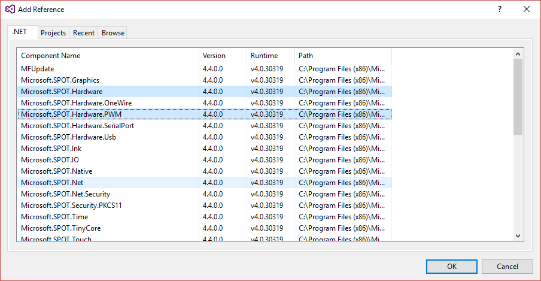
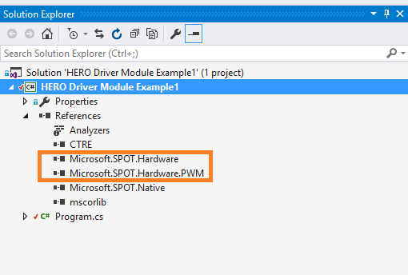

In order to use PWM, Visual Studio project must have two additional references: 
"Microsoft.SPOT.Hardware" and "Microsoft.SPOT.Hardware.PWM" 

Begin by bringing up the references view...

Select the two additional references...

Press OK and confirm new references...

